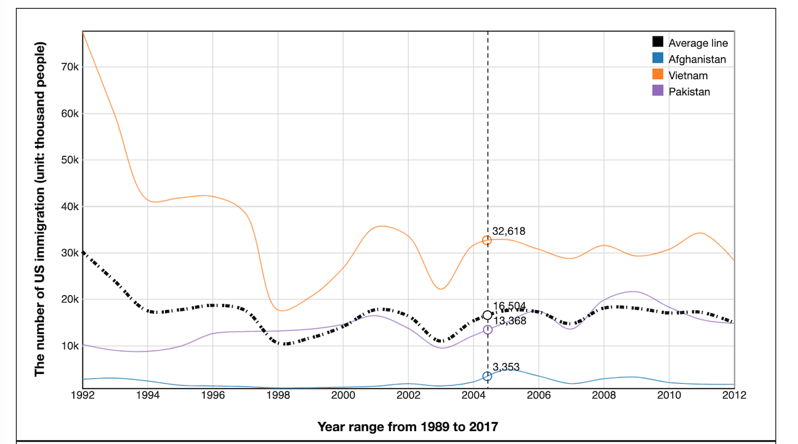

# Project-1-Visualization-US-Immigration

My video: 

Link for page: https://danielnguyen0403.github.io/US-Immigration-Data-Visualization/
#

<h5>Data description:</h5> 
I got the data from website: https://www.migrationpolicy.org/programs/migration-data-hub 
from 1999 to 2017 and combine with another website:https://www.dhs.gov/immigration-statistics
to get another year from 1989 to 1999. In this data, I just have data point by year collection so it cannot go into detail
like another data set.

The data is set into 28 rows (by year) and 196 columns (by countries).

<h5>Emphasis</h5>
In the data, when I need to focus on one data point, country, I can hover and
see how different between a single year and average immigration. Through the average country line, I can also predict 
for the future immigration for each country.
 
Additional, the visualization lets 
me compare 2 different countries in a separated chart with a real data. I also predict a data between 
2 years in a countries by determining a point on a path. By this way, we can guess details for each month 
of the country with a minimum deviation. 